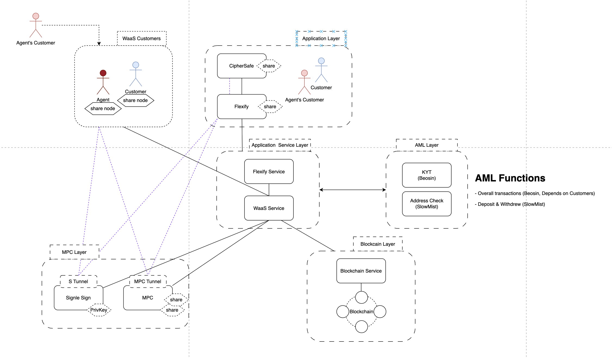
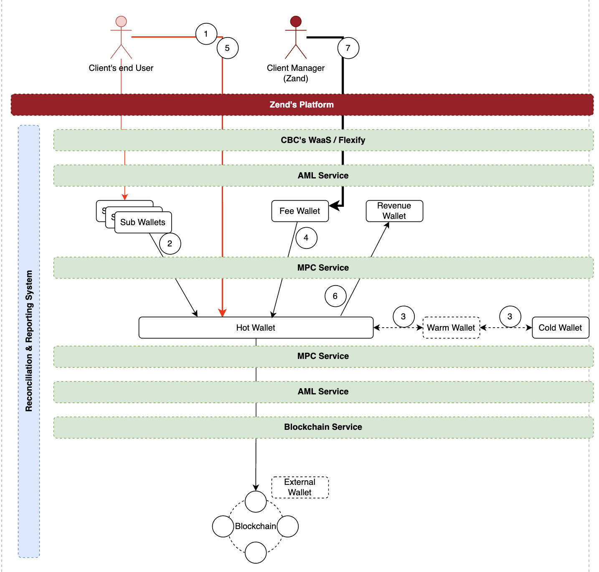
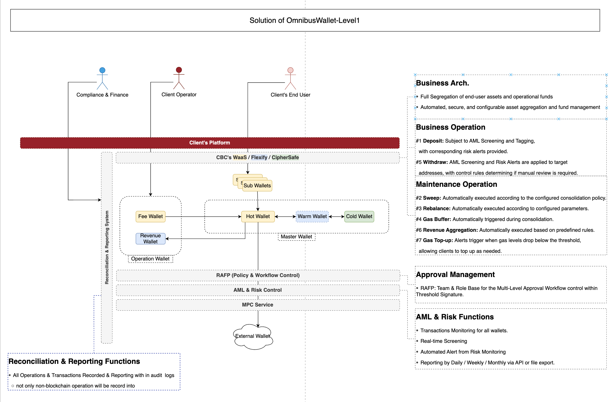
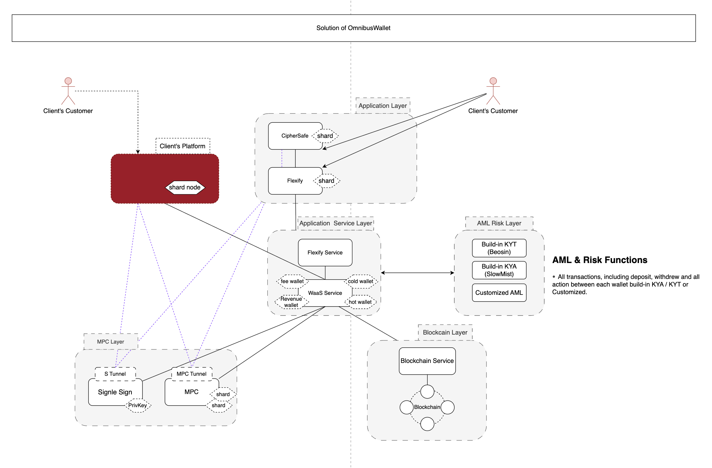
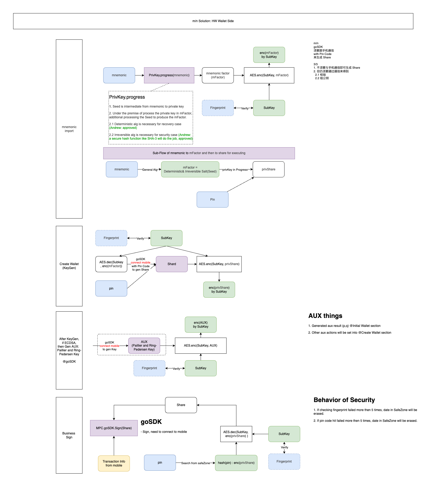
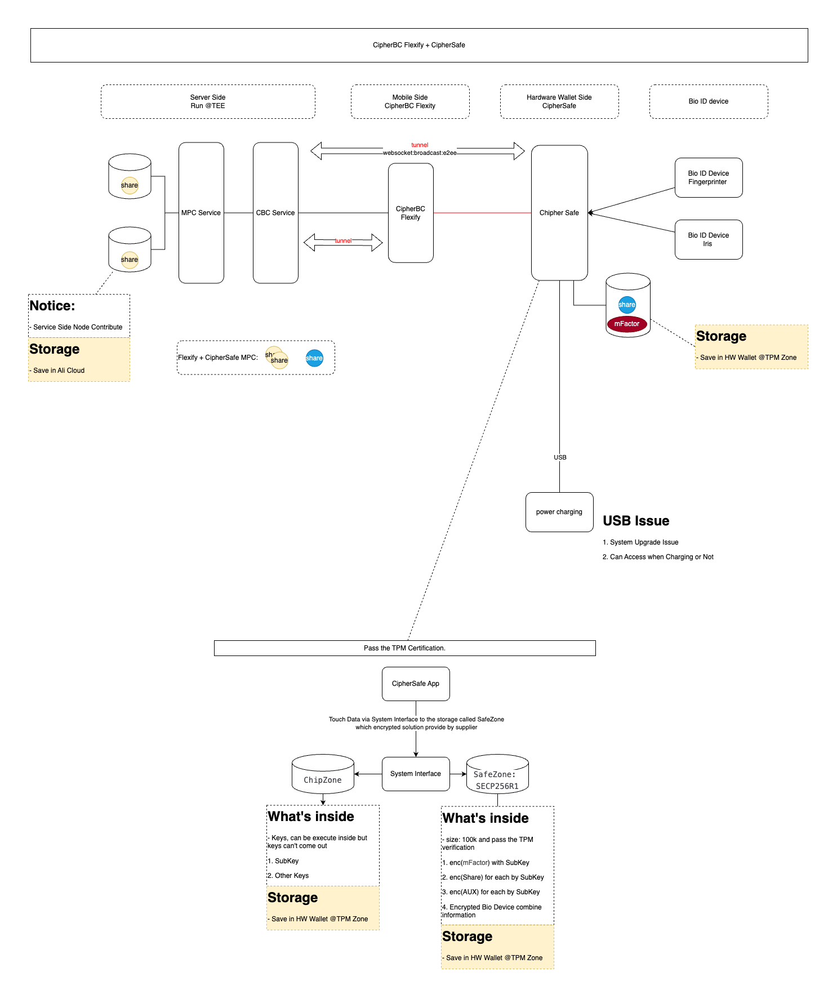

# Open Source Roadmap Overview

## Section 1: Motivation and Vision

### A. Motivation (Why choose to restrict sharing?)

- This project adopts a source-available model rather than a full open source model. The core goal is to maximize value under controlled and trusted conditions.

#### 1. Accelerate transparency and integration with partners.

- Source code will be shared with NDA-signed partners, allowing them to deeply understand internal mechanisms, data flows, and integration points. It will significantly shorten integration cycles.

#### 2. Enhance security and compliance.

- Authorized third parties such as auditors and partner teams can independently conduct code audits and security verification. By uniting external experts, it can strengthen reliability and robustness without exposing core IP.

#### 3. Promote academic collaboration and validation.

- Selected academic institutions will be granted access to verify theoretical research and foster non-commercial innovation in related technical domains.

### B. Project Vision (Goals in Restricted  Sharing)

We aim to establish the technical cornerstone within a trusted ecosystem, achieving:

#### 1. Become the golden standard for security auditing in the blockchain industry.

- Through continuous third-party audits, the project will serve as a verified reference implementation in its technical field.

#### 2. An efficient trust-based collaboration cycle

- Under a strict NDA framework, build an efficient, low-risk collaboration loop that quickly integrates partner and research feedback into core code, forming a unique competitive point.

#### 3. Technical evolution while protecting core IP

Under legal agreements and customized licenses, the project can absorb external optimization and security insights to achieve continuous technical evolution while firmly protecting our core commercial value and intellectual property.

## Section 2: Licensing and Restrictions
⚠️ Important Note: This is not a traditional open-source project. Please note that this project does not follow the traditional open-source definition set by the Open Source Initiative (OSI). It is a source-available project designed for controlled knowledge sharing and collaboration with trusted partners, rather than unrestricted community participation. ⚠️

### 2.1 License Scope and Restrictions
This project uses a Custom Source-Available License (CS-NC License), strictly limiting use to academic and security-related purposes. It is limited in two key dimensions:

#### A. License Scope
It is limited to use the project license. Any commercial use, product integration, redistribution, or creation of derivative works without written authorization from the project owner is prohibited. (See Section 2.2 ) License Selection and Compliance are applicable as the standard license for this account.

* Permitted Uses:
  * Academic Research: Limited to code analysis, algorithm study, or paper publication within non-commercial institutions (e.g., universities, research institutes) with proper source attribution. 
  * Security Auditing and Risk Analysis: Limited to vulnerability testing, compliance review, or functional safety assessment of the project code.

* Prohibited Uses:
  * Commercial Use or Integration: Prohibited from being directly or indirectly integrated into any commercial product or service.
  * Public Disclosure or Redistribution: Prohibited from sharing or distributing the code to any third party without a signed agreement.

#### B. Audience Restriction
Due to the sensitive technology or proprietary information involved in this project, access and use are strictly limited:

* Primary Audience: Only partners under valid NDA or Joint Development Agreements.
 Access is granted exclusively to authorized entities who commit to full confidentiality.

We commit to strictly adhering to the confidentiality clauses in the NDA regarding code, technology, and project information.

* Excluded Audience: Independent developers, the general public, competitors, or entities not meeting the above criteria have no right to access or use the code.

### 2.2 License Selection and Compliance

Selected License: [License](./ref/CBC-OpenSource-License.md) - CipherSafe Source-Available Non-Commercial License (CS-NC License) V1.0

#### A. Necessity and Rationale for a Custom License
- To balance technical transparency (for auditing and research) with protection of core trade secrets, the project adopts a highly customized CS-NC License.
- Differentiate from Traditional license: Unlike OSI-defined open-source licenses, this license strictly prohibits commercial use and limits its audience (see Section 2.1 B), ensuring operations remain within a trusted network
- Legal: CS-NC License terms take effect under the company’s NDA agreements, providing dual protection for intellectual property and commercial interests during code access, research, and usage.

#### B. Contributor License Agreement (CLA)
- Given the project’s sensitivity, contributors must ensure a single legal source and clear IP ownership.
- CIA Rules: Individuals or partners must sign a Contributor License Agreement (CLA) before submitting any code (Pull Request).
- The CLA grants the company the rights to:
  - i. Incorporate submitted code under the CS-NC License;
  - ii. Use or commercialize it in the future without additional authorization.

#### C. Third-Party Supported Compliance
- The project uses necessary third-party components under strict license compliance:
- Audit & Isolation: During Stage 1, all dependencies will undergo license audits to ensure compatibility with the project’s non-commercial objectives (e.g., MIT, Apache 2.0).
- Distribution Restrictions: Although open-source libraries are used, redistribution of the full codebase remains restricted under the CS-NC License. Authorized users may not bypass or violate the original licenses of third-party components.

## Section 3: Timeline and Milestones

| Milestones (Stage) | Core Goals and Scope of Open Source Components | Key Tasks List (Compliance and Execution) | Planned Completion Time |
|---|---|---|---|
|Stage 1: Front-end Application and Emergency Units | Goals: validate controlled release; publish frontend code for review;  enable review and discussion;  prioritize urgent security audits for merchant nodes. |Complete the secure delivery of the first batch of code. 1. Code Audit: Clean and audit code to remove sensitive data.  2. Configuration Settings: Configure GitHub whitelist and NDA partner access.  3. Publications: Publish CS-NC License with code.| Late December|
|Stage 2: MPC Core Library|Goal: release MPC (Multi-Party Computation) core libraries for deep security;  algorithm review for partners doing audits in depth | 1. Fix critical and major security issues internally, ensuring clear boundaries of “proprietary knowledge” as defined in the CS-NC License.  2. Conduct dependency audit: verify licenses of all third-party components used in the MPC library and include compliance statements in the README.   3. If necessary, prepare technical documentation outlining MPC algorithms and security audit guidelines. |Late December|
|Stage 3: Blockchain Access Layer & Others|Goal: complete controlled open-sourcing of the core tech stack and build a comprehensive code audit and research environment. |For critical issues, fix internally and provide an updated system architecture overview to help partners better understand the overall design. |Late January next year|

## Section 4: Scope Boundary of Open Source Components
⚠️ Important Note: Access to the following project source code requires an application. Please have your GitHub account ready and contact support@cipherbc.com for authorization. ⚠️️

### 4.1 Frontend Part: 
<table>
  <tr>
    <th colspan="3">CipherBC Flexify App</th>
  </tr>
  <tr>
    <td colspan="3">Link: ...</td>
  </tr>
  <tr>
    <th>Module</th>
    <th>Stage</th>
  </tr>
  <tr>
    <td>API Reference</td>
    <td>1</td>
  </tr>
  <tr>
    <td>dapp</td>
    <td>1</td>
  </tr>
  <tr>
    <td>MPC Logic Reference</td>
    <td>1</td>
  </tr>
  <tr>
    <td>Related to CipherSafe</td>
    <td>1</td>
  </tr>
  <tr>
    <td>Wallet backup</td>
    <td>1</td>
  </tr>
  <tr>
    <td>CipherCard</td>
    <td>1</td>
  </tr>
  <tr>
    <td>Approval</td>
    <td>2</td>
  </tr>
  <tr>
    <td>Risk Control</td>
    <td>2</td>
  </tr>
  <tr>
    <td>Login and register</td>
    <td>2</td>
  </tr>
  <tr>
    <td>Member/Department/Role Permissions</td>
    <td>2</td>
  </tr>
  <tr>
    <td>Team/Wallet Creation</td>
    <td>2</td>
  </tr>
  <tr>
    <td>Exchange</td>
    <td>2</td>
  </tr>
</table>

<table>
  <tr>
    <th colspan="2">CipherBC Flexify Desk</th>
  </tr>
  <tr>
    <td colspan="2">Link: ...</td>
  </tr>
  <tr>
    <th>Module</th>
    <th>Stage</th>
  </tr>
  <tr>
    <td>API Reference</td>
    <td>1</td>
  </tr>
  <tr>
    <td>DApp</td>
    <td>1</td>
  </tr>
  <tr>
    <td>WaaS</td>
    <td>1</td>
  </tr>
  <tr>
    <td>Exchange</td>
    <td>1</td>
  </tr>
  <tr>
    <td>Approval</td>
    <td>2</td>
  </tr>
  <tr>
    <td>Risk Control</td>
    <td>2</td>
  </tr>
  <tr>
    <td>Team</td>
    <td>2</td>
  </tr>
</table>

<table>
  <tr>
    <th colspan="2">CipherSafe</th>
  </tr>
  <tr>
    <td colspan="2">Link: ...</td>
  </tr>
  <tr>
    <th>Module</th>
    <th>Stage</th>
  </tr>
  <tr>
    <td>Fingerprint SDK Reference</td>
    <td>1</td>
  </tr>
  <tr>
    <td>Storage SDK Reference</td>
    <td>1</td>
  </tr>
  <tr>
    <td>Bluetooth Interaction</td>
    <td>1</td>
  </tr>
  <tr>
    <td>MPC data processing</td>
    <td>1</td>
  </tr>
  <tr>
    <td>Wallet Creation</td>
    <td>1</td>
  </tr>
  <tr>
    <td>Signature Verification</td>
    <td>1</td>
  </tr>
  <tr>
    <td>MPC create/clone/recover/sign</td>
    <td>1</td>
  </tr>
</table>

<table>
  <tr>
    <th>Module</th>
    <th>Stage</th>
    <th>Link</th>
  </tr>
  <tr>
    <td>Key recovery tool</td>
    <td>1</td>
    <td></td>
  </tr>
</table>

### 4.2 MPC Part: 

<table>
  <tr>
    <th colspan="4">CipherSafe / Flexify</th>
  </tr>
  <tr>
    <th>Module</th>
    <th>Stage</th>
    <th>Link</th>
  </tr>
  <tr>
    <td>mpc sdk for ios/ andriod api</td>
    <td>1</td>
    <td></td>
  </tr>
  <tr>
    <td>recovery tool</td>
    <td>2</td>
    <td></td>
  </tr>
</table>

<table>
  <tr>
    <th colspan="4">WaaS(4/4, 1.0)</th>
  </tr>
  <tr>
    <th>Module</th>
    <th>Stage</th>
    <th>Link</th>
  </tr>
  <tr>
    <td>Merchant Node</td>
    <td>1</td>
    <td></td>
  </tr>
</table>

<table>
  <tr>
    <th colspan="4">Waas(m/n)</th>
  </tr>
  <tr>
    <th>Module</th>
    <th>Stage</th>
    <th>Link</th>
  </tr>
  <tr>
    <td>Merchant Node</td>
    <td>3</td>
    <td></td>
  </tr>
</table>

### 4.3 Blockchain Layer: 

<table>
  <tr>
    <th colspan="4">Waas</th>
  </tr>
  <tr>
    <th>Module</th>
    <th>Stage</th>
    <th>Link</th>
  </tr>
  <tr>
    <td>2019 Signature Machine</td>
    <td>3</td>
    <td></td>
  </tr>
  <tr>
    <td>2023 Signature Machine</td>
    <td>3</td>
    <td></td>
  </tr>
  <tr>
    <td>JS Signature Machine</td>
    <td>3</td>
    <td></td>
  </tr>
  <tr>
    <td>Merchant payment address contract source code</td>
    <td>3</td>
    <td></td>
  </tr>
</table>

<table>
  <tr>
    <th colspan="4">Flexify</th>
  </tr>
  <tr>
    <th>Module</th>
    <th>Stage</th>
    <th>Link</th>
  </tr>
  <tr>
    <td>Withdrawal (and MPC interaction) service</td>
    <td>3</td>
    <td></td>
  </tr>
  <tr>
    <td>Integration with business wallet tools</td>
    <td>3</td>
    <td></td>
  </tr>
</table>

<table>
  <tr>
    <th colspan="4">GemW</th>
  </tr>
  <tr>
    <th>Module</th>
    <th>Stage</th>
    <th>Link</th>
  </tr>
  <tr>
    <td>Seal machine service</td>
    <td>3</td>
    <td></td>
  </tr>
  <tr>
    <td>Signature machine service</td>
    <td>3</td>
    <td></td>
  </tr>
</table>

## Section 5: Macro Design
Designed based on the professional and rigorous Omnibus Wallet architecture, we ensured a clear code structure, facilitating systematic and comprehensive security audits by our partners.

### 5.1 Architecture OverAll

### 5.2 Solution of OmnibusWallet - OverAll

#### 5.2.1 Solution of OmnibusWallet - Level 1

#### 5.2.2 Solution of OmnibusWallet - Level 2

### 5.3 CipherSafe Overview

